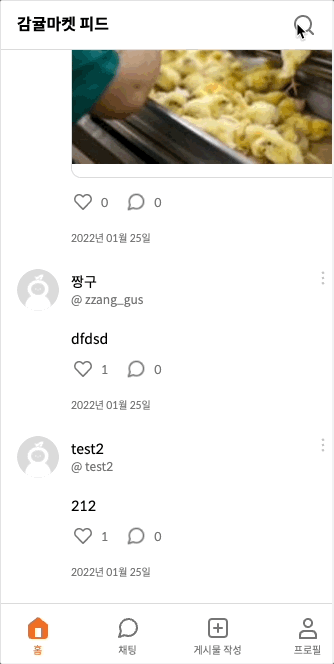
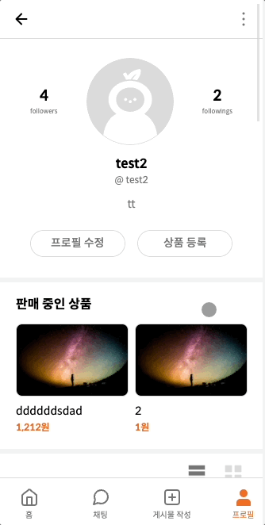

# 감귤마켓 : **멋쟁이사자처럼 프론트엔드 1기** 팀 프로젝트

## 감귤S2 : [장효순](https://github.com/sooonlog), [강지승](https://github.com/jiseung-kang), [한진실](https://github.com/truthone), [주현호](https://github.com/hyjoo1226)

**SNS 클론코딩** : [감귤마켓](http://146.56.183.55:3000/)  
**결과물** : [감귤S2](https://jiseung-kang.github.io/ggul-market/)

## 개요

감귤마켓 프로젝트는 **SNS를 직접 구현한 프로젝트**입니다.  
**게시글에 대한 CRUD와 회원가입, 로그인 기능**을 제공합니다.

## 기능, 서버, 디자인 참조 링크

1. 기능 : [요구사항 명세서](https://paullabworkspace.notion.site/SNS-cdd5ed88a24b499593d7081dc28a5cbc#85eb0582eafa45939c0f7d0f67b02fbb)
2. 디자인 : [피그마 링크](https://www.figma.com/file/Gn6gQJdYwImYsEYSzBXhud/%EB%A9%8B%EC%82%AC_%ED%94%84%EB%A1%A0%ED%8A%B8%EC%97%94%EB%93%9C%EC%8A%A4%EC%BF%A8?node-id=39%3A1814)
3. [서버1](http://146.56.183.55:5050/) , [서버2](https://api.mandarin.cf/)
   // 해당 서버가 닫혀있을 시 프로젝트가 제대로 동작하지 않을 수 있음.

## 개발 환경

**OS** : Mac, Window  
**Frontend**: HTML, CSS, JavaScript  
**Backend** : [API 명세](https://paullabworkspace.notion.site/API-b9c93280e29f4670b324009d4461f4d5)  
**IDE** : VS Code  
**Team Collaboration Tool** : Git, Git Projects, Discord  
**Platform** : Mobile Web  
**Test Browser** : Chrome Version 97.0.4692.71, Safari Version 15.2  
**Test Device** : iPhoneSE/XR/12, Gallaxy S12

## 기능 구현 상세

<table style="width: 100%;">
    <thead>
      <tr>
        <th colspan="3" style="background:black;color:white;text-align:center;">감귤마켓 SNS 팀 프로젝트 진행 현황</th>
      </tr>
    </thead>
    <tbody>
      <tr>
        <th>이름</th>
        <th>주요 기능</th>
        <th>참조 번호</th>
      </tr>
      <tr>
        <td>장효순</td>
        <td>
            로그인, 회원가입, 프로필 수정, 홈 피드 디자인 및 기능 구현
        </td>
        <td>
            1~4, 8
        </td>
      </tr>
      <tr>
        <td>강지승</td>
        <td>
            프로필 피드, 팔로잉/팔로워 디자인 및 기능 구현
        </td>
        <td>
          5~7
        </td>
      </tr>
      <tr>
        <td>한진실</td>
        <td>
          상품,게시글,채팅목록 디자인 구현
        </td>
        <td>
          9~12
        </td>
      </tr>
      <tr>
        <td>주현호</td>
        <td>
          채팅방, 하단 탭 메뉴, 좋아요 버튼, 댓글 등록/수정/삭제, 모달창 디자인 및 기능 구현
        </td>
        <td>
          13~16
        </td>
      </tr>
    </tbody>
  </table>

**1. splash**

<p align="center">
    
    &nbsp;&nbsp;&nbsp;&nbsp;&nbsp;&nbsp;&nbsp;&nbsp;&nbsp;&nbsp;&nbsp;&nbsp;&nbsp;&nbsp;&nbsp;&nbsp;&nbsp;&nbsp;&nbsp;
    
</p>
      
**2. 로그인**

<p align="center">
    
</p>

**3. 회원가입**

<p align="center">
    
    &nbsp;&nbsp;&nbsp;&nbsp;&nbsp;&nbsp;&nbsp;&nbsp;&nbsp;&nbsp;&nbsp;&nbsp;&nbsp;&nbsp;&nbsp;&nbsp;&nbsp;&nbsp;&nbsp;
    
</p>

**4. 감귤마켓 피드(홈 화면)**

<p align="center">
    
    &nbsp;&nbsp;&nbsp;&nbsp;&nbsp;&nbsp;&nbsp;&nbsp;&nbsp;&nbsp;&nbsp;&nbsp;&nbsp;&nbsp;&nbsp;&nbsp;&nbsp;&nbsp;&nbsp;
    
</p>

**5. 검색**☑️

<p align="center">
    
</p>

**6. 사용자 프로필 페이지**☑️

<p align="center">
    
</p>


**7. 팔로워, 팔로잉 목록**

<p align="center">
    
</p>

**8. 내 프로필 수정**

<p align="center">
    
</p>

**9. 상품 등록**

- 나의 프로필 페이지에서 `상품 등록` 버튼을 클릭하면 상품을 등록할 수 있는 페이지가 나타납니다.
- 상품 이미지, 상품명, 가격, 판매링크를 입력받을 수 있으며, 모든 입력이 완료되면 `저장` 버튼이 활성화됩니다.
- 상품명은 2~15자 이내로 입력되게 하고, 가격은 숫자를 입력하면 자동으로 원단위로 변환시킵니다.

**10. 게시글 댓글 페이지**

- 게시글 하단에 말풍선 아이콘을 클릭하면 댓글을 확인하고 입력할 수 있는 페이지가 나타납니다.
- 댓글 입력창에 텍스트를 입력하면 `게시` 버튼이 활성화됩니다.

**11. 게시글 작성 페이지**☑️

- 게시글을 작성할 수 있는 페이지로, 하단 메뉴바에서 `게시글 작성` 을 클릭하면 표시됩니다.
- 글이 입력되거나 사진이 업로드 되면 `업로드` 버튼이 활성화되고, 버튼을 누르면 게시글이 업로드됩니다.
- 사진은 우측 하단 버튼을 클릭하면 업로드할 수 있으며, 최대 3장까지 업로드 가능합니다.

**12. 채팅 목록**

- 채팅 목록과 채팅방은 마크업 구현 및 스타일 적용만 진행합니다.☑️
- 현재 대화가 진행 중인 채팅 목록이 표시됩니다.
- 내가 읽지 않은 메시지가 있는 채팅방인 경우 프로필 사진 좌측 상단에 작은 원으로 표시됩니다.☑️

**13. 채팅방**

- 채팅 목록과 채팅방은 마크업 구현 및 스타일 적용만 진행합니다.☑️
- 채팅 목록에서 목록 아이템을 클릭하면 해당 채팅방이 나타납니다.
- 채팅 기능은 구현하지 않습니다.☑️
- 채팅 입력창에서 텍스트가 입력되면 `전송` 버튼이 활성화됩니다.☑️
- 이미지 버튼을 클릭하고 이미지를 선택하면 전송 버튼이 활성화됩니다.
- 채팅방 상단 우측 버튼을 클릭하면 아래와 같은 모달이 화면 하단에 나타납니다.

**14. 하단 탭 메뉴**

- 하단 탭 메뉴는 홈, 채팅, 게시물 작성, 프로필 4개의 메뉴로 구성되어 있습니다.
- 모든 페이지는 페이지 경로에 해당하는 탭 메뉴가 활성화됩니다.

**15. 좋아요 버튼**

- 게시글이 나타나는 모든 페이지에 해당합니다.
- 게시글 하단에는 하트 모양에 좋아요 버튼이 있습니다.
- 빈 하트를 클릭하면 색이 칠해진 하트로 변하고, 색이 칠해진 하트를 누르면 빈 하트로 변합니다.
- 좋아요 기능은 구현하지 않습니다.

**16. 모달 버튼**

- 우측 버튼을 클릭하면 아래와 같은 모달이 화면 하단에 나타납니다.
- 헤더에 있는 버튼을 클릭하면 설정 및 개인정보와 로그아웃이 나타납니다.
- 게시글 우측 상단에 위치한 버튼을 클릭했을 경우

  - 내가 작성한 게시글일 경우 : 삭제, 수정 버튼이 나타납니다.
  - 다른 사용자가 작성한 게시글일 경우 : 신고하기 버튼이 나타납니다.

- 댓글 우측 상단에 위치한 버튼을 클릭했을 경우
  - 내가 작성한 댓글일 경우 : 삭제 버튼이 나타납니다.
  - 다른 사용자가 작성한 댓글일 경우 : 신고하기 버튼이 나타납니다.
- 로그아웃, 삭제, 신고 버튼을 누르면 확인 메시지 모달창이 나타나야 하고, 취소 버튼을 누르면 모달은 사라집니다.

## 기타 도전 기능

**댓글**

- 댓글 삭제 및 신고하기 기능을 구현합니다.☑️
- 댓글 작성이 현재 시간으로 부터 몇 초, 분, 시간 전에 작성되었는지 표시합니다.☑️
- 댓글 개수는 카운트 되어 말풍선 아이콘 우측에 표시됩니다.☑️

**채팅 기능**☑️

## 향후 계획

**Refactorying**

- 중복코드 모듈화
- 파일 통합

**Backend**

- 서버 구축
- 배포

## Directory 구성 (HTML, CSS, JS)

```
.
├── README.md
├── images
│   ├── 중략
│   └── ...
├── pages
│   ├── login.html
│   ├── login_email.html
│   ├── join_email.html
│   ├── home.html
│   ├── search.html
│   ├── profile.html
│   ├── followers.html
│   ├── profile_modification.html
│   ├── addProduct.html
│   ├── uploadPage.html
│   ├── chat_page.html
│   ├── chat_list.html
│   ├── chat_room.html
│   ├── like_button.html
│   ├── modal.html
│   ├── module.html
│   ├── page-404.html
│   └── test_modal.html
├── css
│   ├── common.css
│   ├── login.css
│   ├── signin.css
│   ├── join_membership.css
│   ├── home.css
│   ├── search.css
│   ├── profile.css
│   ├── followers.css
│   ├── profile_modification.css
│   ├── addProduct.css
│   ├── uploadPage.css
│   ├── chat_list.css
│   ├── chat_room.css
│   ├── like_button.css
│   ├── modal.css
│   ├── module.css
│   ├── page-404.css
│   └── reset.css
└── scripts
│   ├── 9.addProduct.js
│   ├── 11.uploadPage.js
│   ├── constants.js
│   ├── initPage.js
│   ├── script.js
│   └── api.js
└── index.html
```

## License

감귤마켓 SNS는 **멋쟁이 사자처럼 프론트엔드 1기 과정에서 진행된 프로젝트**이며 사용된 **이미지, 서버 API**는 **(주)위니브**로부터 제공받았습니다.

페이지별 UI/UX 디자인 레퍼런스는 [피그마](https://www.figma.com/file/Gn6gQJdYwImYsEYSzBXhud/%EB%A9%8B%EC%82%AC_%ED%94%84%EB%A1%A0%ED%8A%B8%EC%97%94%EB%93%9C%EC%8A%A4%EC%BF%A8?node-id=39%3A1814)를 활용했으며,  
**일부 서버 API 요청 코드를 제외**한 **모든 HTML/CSS/JavaScript 코드**는 팀원들이 직접 작성하였습니다.
